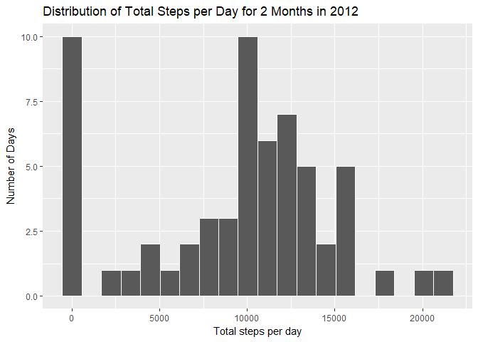
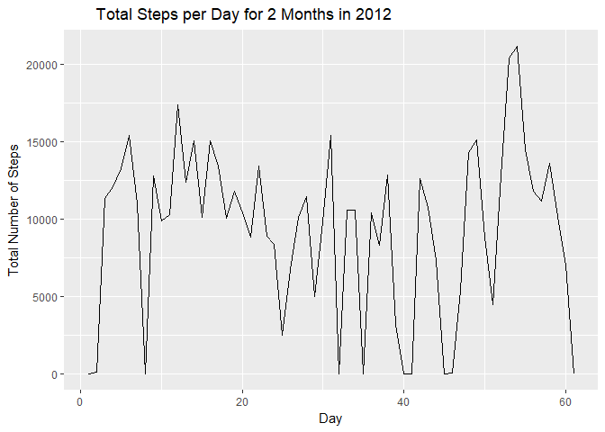
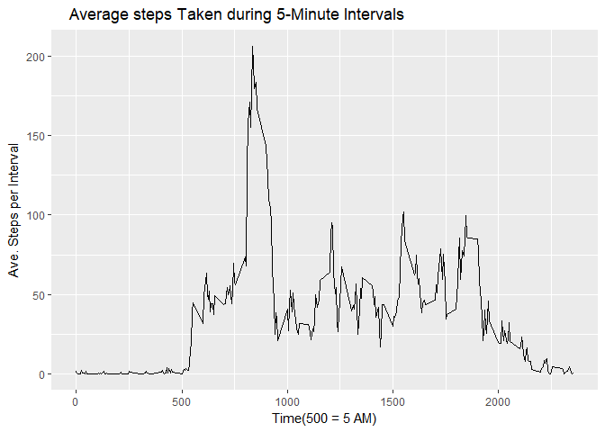
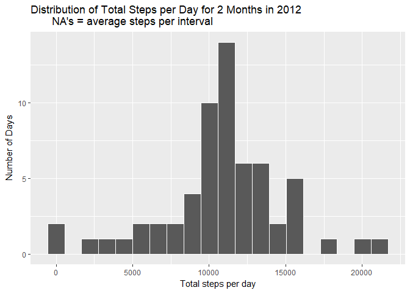
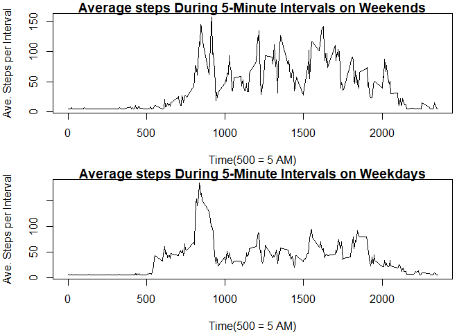

# Reproducible Research: Peer Assessment 1

Author: Mel Crotzer
Date: july 15, 2017

## Loading and preprocessing the data


```r
unzip("./activity.zip")
fitt<-read.csv('./activity.csv', header=TRUE)
```

## What is mean total number of steps taken per day?

Group the number of steps by date and calculate the totals for each day. Change the factor date to numeric for clearer plots. Compute mean & median.


```r
library(dplyr)
```

```
## 
## Attaching package: 'dplyr'
```

```
## The following objects are masked from 'package:stats':
## 
##     filter, lag
```

```
## The following objects are masked from 'package:base':
## 
##     intersect, setdiff, setequal, union
```

```r
library(ggplot2)
library(knitr)

stepspday <- mutate(fitt, Date=as.numeric(date)) %>% group_by(Date)%>% 
      summarize(TotSteps = sum(steps, na.rm=TRUE))
# Histogram
ggplot(stepspday, aes(x=TotSteps)) +
         geom_histogram(bins = 20, color="white") +
         labs(x= "Total steps per day", y= "Number of Days",
              title="Distribution of Total Steps per Day for 2 Months in 2012")
```

<!-- -->

```r
# time Series
ggplot(stepspday, aes(x = Date, y = TotSteps)) +
  geom_line() +
  labs(x= "Day", y= "Total Number of Steps",
       title="       Total Steps per Day for 2 Months in 2012")
```

<!-- -->

```r
Avestpd <- mean(stepspday$TotSteps, na.rm=TRUE)
Medstpd <- median(stepspday$TotSteps, na.rm=TRUE)
```

The average number of steps per day is 9354.2295082.

The median number of steps per day is 10395.

The distribution is skewed left.

## What is the average daily activity pattern?

Group the number of steps by interval.


```r
stepspint <- group_by(fitt, interval)%>% 
  summarize(AveSteps = mean(steps, na.rm=TRUE))

ggplot(stepspint, aes(x = interval, y = AveSteps)) +
  geom_line() +
  labs(x= "Time(500 = 5 AM)", y= "Ave. Steps per Interval",
       title="    Average steps Taken during 5-Minute Intervals")
```

<!-- -->

```r
maxstpint <- max(stepspint$AveSteps)
intmax <- stepspint$interval[stepspint$AveSteps==max(stepspint$AveSteps)]
avestpint <- mean(stepspint$AveSteps)
```

The maximum number of steps per 5-interval is 206.1698113.
This occurrs at 835.

The activity starts at 5 AM, peaks at 8:30 AM and is moderate until about 8 PM.

The average number of steps per minute overall is 37.3825996
This latter average will be used to fill in the NA's in the next step.

## Imputing missing values

The number of NA's is found from the number of rows of the "fitt" file
filtered for NA's. The average steps per interval from Question 3 is substituted
for all the NA,s.  


```r
norownas <- filter(fitt, is.na(fitt$steps))
nonas <- nrow(norownas)

for (i in 1:17568) {
  if (is.na(fitt$steps[i])) {
    fitt$steps[i] <- avestpint
  }
 
}

fitt_nona <- fitt
stepspday <- mutate(fitt_nona, Date=as.numeric(date)) %>% group_by(Date)%>% 
  summarize(TotSteps = sum(steps, na.rm=TRUE))

ggplot(stepspday, aes(x=TotSteps)) +
  geom_histogram(bins = 20, color="white") +
  labs(x= "Total steps per day", y= "Number of Days",
       title="Distribution of Total Steps per Day for 2 Months in 2012
       NA's = average steps per interval")
```

<!-- -->

```r
Avestpdnna <- mean(stepspday$TotSteps, na.rm=TRUE)
Medstpdnna <- median(stepspday$TotSteps, na.rm=TRUE)
```
The number of NA's in the data set is 2304.

The average number of steps per day is 1.0766189\times 10^{4}.

The median number of steps per day is 1.0766189\times 10^{4}.

The distribution is symmetric.  The mean equals the median and both are
larger than the stepage calculated in Question 2.

## Are there differences in activity patterns between weekdays and weekends?

The original file, revised for NA's, is first mutated into weekdays, then
split into weekend and weekday files. The separate files are grouped by interval and plotted as a pannel.


```r
fitt3 <- mutate(fitt_nona, Date=as.Date(date), 
                WeekDay=weekdays(Date,abbreviate=FALSE))

stepspint_we <- filter(fitt3, WeekDay=="Saturday" | WeekDay=="Sunday") %>% 
  group_by(interval)%>% summarize(AveSteps = mean(steps, na.rm=TRUE))

stepspint_wd <- filter(fitt3, WeekDay!="Saturday" | WeekDay!="Sunday") %>% 
  group_by(interval)%>% summarize(AveSteps = mean(steps, na.rm=TRUE))

par(mfrow = c(2,1), mar=c(4, 4, 1, 1))
plot(stepspint_we$interval, stepspint_we$AveSteps, type="l",
        main="Average steps During 5-Minute Intervals on Weekends",
     xlab="Time(500 = 5 AM)", ylab= "Ave. Steps per Interval")
plot(stepspint_wd$interval, stepspint_wd$AveSteps, type="l",
     main="Average steps During 5-Minute Intervals on Weekdays",
     xlab="Time(500 = 5 AM)",ylab= "Ave. Steps per Interval")
```

<!-- -->

During weekdays, activity starts at 5 AM, peaks at 8:30 AM, and is moderate thereafter until about 8 PM. During weekends, the initial activity starts later
and is greater during the day than the profile for weekdays.  This person probably works out in the early AM each day and is maybe shopping during the weekend PM and perhaps is deskbound during the PM on weekdays.

